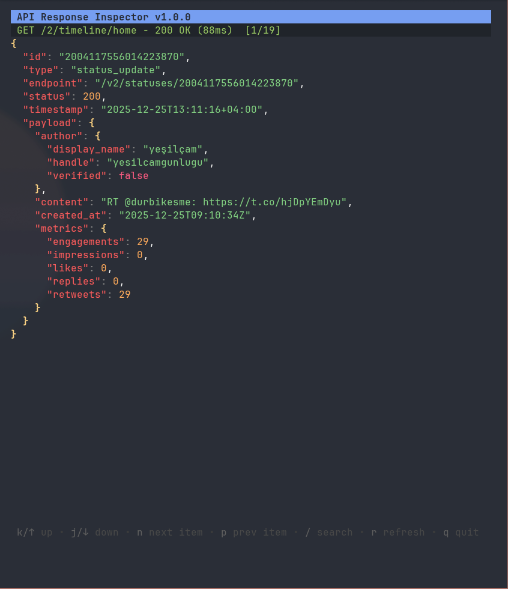

# xjson

### A TUI app that lets you browse your X feed.

Browse your timeline while looking like you're debugging JSON data.


## Why?

Sometimes you want to check X without it being obvious. **xjson** displays tweets as JSON API responses - to anyone watching, you're just inspecting some API data.



```json
{
  "id": "1234567890",
  "type": "status_update",
  "endpoint": "/v2/statuses/1234567890",
  "payload": {
    "content": "Hello world!",
    "author": {
      "handle": "user123",
      "display_name": "User Name"
    },
    "metrics": {
      "impressions": 1520,
      "likes": 45
    }
  }
}
```

## Features

- View home timeline as JSON
- Search tweets
- Syntax-highlighted JSON output
- Vim-style navigation
- OAuth 2.0 authentication
- Rate limit handling

## Installation

### From source

```bash
git clone https://github.com/YOUR_USERNAME/xjson.git
cd xjson
go build -o xjson .
```

### Requirements

- Go 1.21+
- X Developer Account (free tier works)

## Setup

### 1. Get X API Credentials

1. Go to [X Developer Portal](https://developer.twitter.com/en/portal/dashboard)
2. Create a Project and App
3. In **User authentication settings**:
   - Enable OAuth 2.0
   - Set callback URL: `http://localhost:8080/callback`
   - Request **Read** permissions
4. Copy your **Client ID**

### 2. Configure

Create `xjson.yaml` in the project directory:

```yaml
client_id: YOUR_CLIENT_ID
client_secret: YOUR_CLIENT_SECRET # optional for public clients
redirect_url: http://localhost:8080/callback
```

### 3. Run

```bash
./xjson
```

On first run, it will open an auth URL - authorize in your browser and you're in.

## Usage

### Keybindings

| Key       | Action           |
| --------- | ---------------- |
| `j` / `↓` | Scroll down      |
| `k` / `↑` | Scroll up        |
| `n`       | Next tweet       |
| `p`       | Previous tweet   |
| `g`       | Go to top        |
| `G`       | Go to bottom     |
| `Ctrl+d`  | Half page down   |
| `Ctrl+u`  | Half page up     |
| `/`       | Search           |
| `r`       | Refresh          |
| `t`       | Back to timeline |
| `?`       | Toggle help      |
| `q`       | Quit             |

### Commands

```bash
./xjson          # Start the app
./xjson init     # Create default config
./xjson auth     # Manually authenticate
./xjson help     # Show help
```

## Project Structure

```
xjson/
├── main.go              # Entry point & CLI
├── xjson.yaml           # Config file
├── config/
│   └── config.go        # Config loading
└── internal/
    ├── api/
    │   ├── client.go    # X API client
    │   ├── auth.go      # OAuth 2.0 PKCE
    │   └── types.go     # API types
    ├── transform/
    │   └── json.go      # Tweet → JSON transform
    └── ui/
        ├── app.go       # TUI application
        ├── keys.go      # Keybindings
        └── styles.go    # Colors & styles
```

## Rate Limits

X API Free tier has strict limits (~15 requests per 15 min). If you hit 429 errors, wait a few minutes.

## License

MIT License - see [LICENSE](LICENSE) for details.

## Acknowledgments

Built with:

- [Bubble Tea](https://github.com/charmbracelet/bubbletea) - TUI framework
- [Lip Gloss](https://github.com/charmbracelet/lipgloss) - Styling
- [X API v2](https://developer.twitter.com/en/docs/twitter-api)
